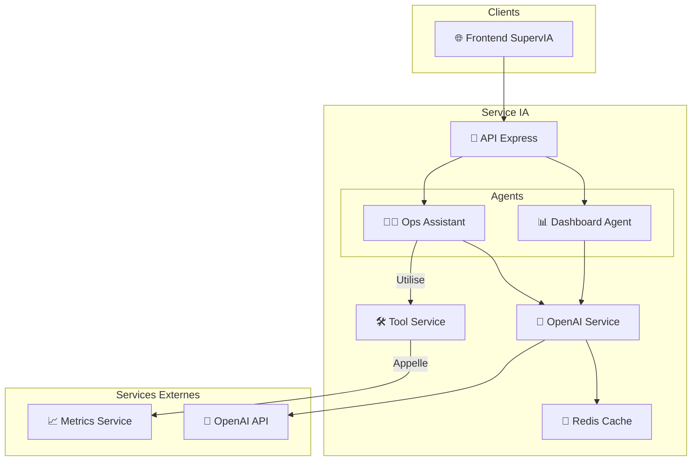

# 🤖 SupervIA AI Service - Le Cerveau de la Plateforme

[](https://github.com/zkerkeb-class/service-ia-Tadayoshi123)
[](https://nodejs.org/)
[](./LICENSE)

> **Microservice central qui héberge les agents d'intelligence artificielle de SupervIA.**

Ce service est le cœur intelligent de l'écosystème. Il expose deux agents spécialisés qui transforment les données brutes de monitoring en informations actionnables et assistent les utilisateurs dans la création et l'interprétation de leurs dashboards de supervision.

---

## 📋 Table des matières

1.  [**Architecture & Agents**](#-architecture--agents)
    -   [Agent Générateur de Dashboards](#-agent-générateur-de-dashboards)
    -   [Assistant Opérationnel (Ops Assistant)](#-assistant-opérationnel-ops-assistant)
2.  [**Installation et Lancement**](#-installation-et-lancement)
3.  [**Documentation de l'API**](#-documentation-de-lapi)
    -   [Endpoints du Dashboard Agent](#-endpoints-du-dashboard-agent)
    -   [Endpoints de l'Ops Assistant](#-endpoints-de-lops-assistant)
4.  [**Fonctionnement des Outils (Function Calling)**](#-fonctionnement-des-outils-function-calling)
5.  [**Gestion du Cache**](#-gestion-du-cache)
6.  [**Sécurité**](#-sécurité)

---

## 🏗️ Architecture & Agents

Le Service IA est conçu autour de deux agents distincts, chacun avec une mission spécifique. Il s'appuie sur **OpenAI (GPT-4o-mini)** pour ses capacités de raisonnement et sur **Redis** pour la mise en cache des réponses coûteuses.



### 📊 Agent Générateur de Dashboards
Cet agent est un spécialiste de la création de dashboards de supervision. Il transforme des demandes en langage naturel en configurations JSON complexes et valides.

**Fonctionnalités clés :**
-   **Génération de dashboards** à partir d'une simple phrase (ex: "Crée un dashboard pour mon API backend").
-   **Optimisation de dashboards existants** pour améliorer la lisibilité ou les performances.
-   **Validation de configurations** pour garantir leur cohérence et leur efficacité.
-   **Suggestion de layouts** et de templates basés sur les meilleures pratiques UX.
-   **Recommandation de blocs** pertinents pour enrichir un dashboard.
-   **Explication en langage naturel** de configurations complexes.

Pour garantir des sorties fiables, cet agent utilise l'option `response_format: { type: "json_object" }` de l'API OpenAI pour toutes les tâches nécessitant un JSON structuré.

### 🧑‍💻 Assistant Opérationnel (Ops Assistant)
Cet agent est un chatbot expert en opérations d'infrastructure. Il est capable de dialoguer avec l'utilisateur et d'utiliser des outils pour interagir avec l'écosystème SupervIA en temps réel.

**Fonctionnalités clés :**
-   **Chat conversationnel** avec maintien de l'historique de session.
-   **Utilisation d'outils (Function Calling)** pour obtenir des données fraîches.
-   **Analyse de métriques** et diagnostic de problèmes de performance.
-   **Suggestion de règles d'alerting** basées sur le contexte.
-   **Aide à la planification de capacité**.
-   **Explication de métriques** et de concepts de supervision.

---

## 🚀 Installation et Lancement

### Prérequis
-   **Node.js** >= 18.x
-   **Docker** & **Docker Compose**
-   Une **clé d'API OpenAI** valide avec un accès à `gpt-4o-mini`.
-   Un serveur **Redis** (recommandé).

### Configuration (.env)
1.  Copiez le fichier d'exemple : `cp .env.example .env`
2.  Ouvrez `.env` et remplissez les variables :
    -   `OPENAI_API_KEY`: Votre clé secrète OpenAI.
    -   `JWT_SECRET`: Doit être **identique** à celui de l'Auth Service.
    -   `REDIS_*`: Vos identifiants de connexion Redis.
    -   `*_SERVICE_URL`: Les URLs des autres microservices.

### Lancement avec Docker
```bash
# Depuis la racine du projet, avec le docker-compose global
docker-compose up -d supervia-ai-service

# Pour voir les logs
docker-compose logs -f supervia-ai-service
```

---

## 📖 Documentation de l'API

Une documentation Swagger complète est disponible sur le endpoint `/api-docs`.

### Authentification
Toutes les routes sont protégées et nécessitent un token `Bearer` JWT valide fourni par l'Auth Service.

---

### 📊 Endpoints du Dashboard Agent
Préfixe: `/api/dashboard-agent`

-   `POST /generate`: Crée un dashboard JSON complet à partir de besoins décrits en langage naturel.
-   `POST /optimize`: Propose une version optimisée d'un dashboard existant.
-   `POST /validate`: Valide la structure et la cohérence d'une configuration JSON.
-   `POST /suggest-layout`: Suggère une disposition de grille pour un ensemble de métriques.
-   `POST /recommend-blocks`: Suggère des blocs pertinents à ajouter à un dashboard.
-   `POST /suggest-templates`: Propose des modèles de dashboards basés sur un cas d'usage.
-   `POST /explain`: Fournit une explication textuelle d'une configuration de dashboard.
-   `GET /templates`: Récupère la liste des templates de dashboard prédéfinis.

---

### 🧑‍💻 Endpoints de l'Ops Assistant
Préfixe: `/api/ops-assistant`

-   `POST /chat`: Point d'entrée principal pour dialoguer avec l'assistant. Gère l'historique de conversation et les appels d'outils.
-   `POST /analyze-metrics`: Demande une analyse de haut niveau sur un ensemble de métriques.
-   `POST /diagnose-issue`: Lance un diagnostic basé sur des symptômes décrits.
-   `POST /suggest-alerts`: Suggère des règles d'alerting pertinentes pour un contexte donné.
-   `POST /explain-metric`: Demande une explication détaillée pour une métrique spécifique.

---

## 🛠️ Fonctionnement des Outils (Function Calling)

L'Ops Assistant utilise la capacité de "Function Calling" d'OpenAI pour interagir avec son environnement. Lorsqu'il détermine qu'il a besoin d'informations, il ne répond pas directement mais génère une requête pour appeler un outil.

**Outils disponibles :**
-   `prometheusQuery`: Exécute une requête PromQL instantanée.
-   `prometheusRangeQuery`: Exécute une requête PromQL sur une période de temps.
-   `getServiceHealth`: Vérifie le statut de santé des microservices.
-   `getActiveAlerts`: Récupère les alertes actuellement actives.
-   `generateDashboard`: Fait appel au Dashboard Agent pour créer un dashboard.
-   `analyzePerformance`: Lance une analyse de performance complète.
-   `diagnoseIssue`: Lance un diagnostic automatique.

Ce mécanisme lui permet de fournir des réponses basées sur des **données en temps réel** plutôt que sur des connaissances statiques.

---

## 💾 Gestion du Cache

Pour optimiser les coûts et les temps de réponse, le service IA met en cache les réponses d'OpenAI dans **Redis**.
-   Une clé de cache unique est générée pour chaque requête.
-   Les réponses pour des demandes identiques sont servies depuis le cache, réduisant la latence et les appels à l'API OpenAI.
-   La durée de vie (TTL) du cache est configurable par type de requête (ex: 2h pour la génération de dashboard, 30min pour l'analyse de métriques).
-   Le cache peut être désactivé via la variable d'environnement `USE_CACHE=false`.

---

## 🔐 Sécurité

-   **Authentification JWT (RS256)**: Le service valide les tokens JWT en utilisant les clés publiques (JWKS) fournies par l'Auth Service. Cela garantit que seuls les utilisateurs authentifiés peuvent interagir avec les agents.
-   **Validation des Entrées**: Utilisation de `express-validator` pour valider et nettoyer rigoureusement toutes les entrées API.
-   **Rate Limiting**: Limite le nombre de requêtes par IP pour prévenir les abus.
-   **Prévention des Injections de Prompt**: Bien que difficile à contrer entièrement, les prompts système sont conçus pour être très directifs et limiter la marge de manœuvre de l'IA.

## 🚀 Démarrage Rapide

```